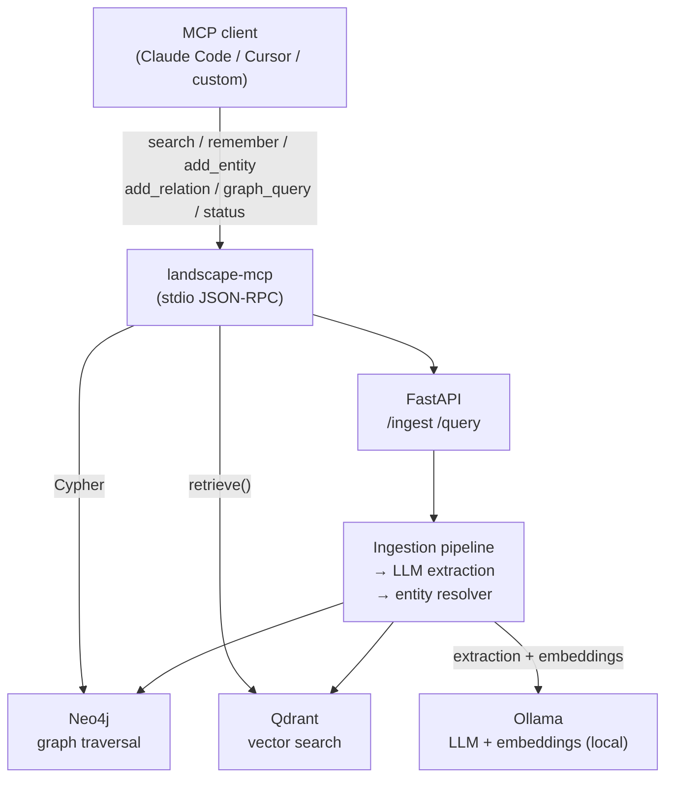

# Landscape

Landscape is a local-first agent memory system that enables multi-hop reasoning through hybrid Neo4j graph traversal and Qdrant vector similarity search. Unlike MemPalace (ChromaDB nearest-neighbor, flat SQLite triples) and basic RAG systems, Landscape stores every memory as both a vector embedding and a node in a real knowledge graph — so when an answer requires connecting three facts across three documents, a single Cypher traversal finds the chain instead of failing silently. Retrieval combines vector similarity candidates with graph neighborhood expansion, deduplicates, and scores by similarity x graph distance x recency. Everything runs locally: Neo4j + Qdrant + Ollama + FastAPI in one `docker compose up`.

## The killer demo

Seven questions across 1/2/3-hop bands, same killer-demo corpus (`tests/fixtures/killer_demo_corpus/`):

| Mode                 | P@k    | MRR    | Notes                                               |
|----------------------|--------|--------|-----------------------------------------------------|
| Landscape (hybrid)   | 100%   | 0.306  | Hits all 7 queries including the 3-hop chain        |
| Landscape (vector)   | 71.4%  | 0.149  | Misses the 2-hop "who approved Aurora's database?"  |
| ChromaDB*            | 86%    | 0.43*  | Misses the 3-hop chain entirely (P@1 = 0% at 3-hop) |

*ChromaDB is evaluated at chunk level; Landscape at entity level. Do not compare MRR numbers directly — the granularity differs. The apples-to-apples claim is per-question: ChromaDB answers 6/7 questions (all 1/2-hop), Landscape hybrid answers 7/7 including the one that requires "Aurora → Sarah → Platform Team" in a single traversal. No single chunk in the corpus contains that chain, so chunk similarity can never surface it.

The 3-hop question is the proof point. Reproduce with:

```bash
uv sync --extra bench
uv run python scripts/bench_retrieval.py    # Landscape hybrid + vector + graph
uv run python scripts/bench_chromadb.py     # ChromaDB baseline
```

## Architecture



## Phase status

### Phase 1 — Local stack and text ingestion
- [x] Docker Compose: Neo4j + Qdrant + Ollama + FastAPI
- [x] Ollama setup with local model (Llama 3.1 8B / nomic-embed-text)
- [x] FastAPI ingestion endpoint — accepts text/markdown/plaintext
- [x] LLM-powered entity + relationship extraction via structured output prompting
- [x] Entity resolution: fuzzy name matching + coreference detection across documents
- [x] Store entities as Neo4j nodes with properties
- [x] Store relationships as typed Neo4j edges with metadata
- [x] Generate embeddings locally (sentence-transformers / Ollama)
- [x] Store embeddings in Qdrant with neo4j_node_id cross-references in payload
- [x] Integration tests: ingest a doc, verify graph + vector state

### Phase 2 — Hybrid retrieval engine
- [x] Vector similarity search (Qdrant top-k nearest neighbors)
- [x] Graph traversal from matched nodes — BFS/DFS, 1-3 hop configurable depth
- [x] Hybrid merge: deduplicate and rank results from both retrieval paths
- [x] Scoring function: vector similarity x graph distance x recency weighting
- [x] Context assembly: format retrieved subgraph for LLM consumption
- [x] LangChain custom retriever interface
- [x] Temporal filtering: only retrieve currently-valid facts (supersession-aware)
- [x] Benchmark script: hybrid vs vector-only vs graph-only on multi-hop test corpus
- [x] Build the killer demo dataset (fictional company docs, 1/2/3-hop questions)

### Phase 3 — Agent integration and MCP
- [x] MCP server: expose search, ingest, graph query, and status as MCP tools
- [x] LangChain agent with Landscape as custom memory backend
- [x] Memory persistence across agent sessions
- [x] Write-back: agent can add new memories during conversation
- [x] Temporal conflict resolution with SUPERSEDES chains and audit trail
- [x] Side-by-side demo: same questions with Landscape vs ChromaDB-only
- [x] README with architecture diagram, benchmark results, and setup instructions

### Phase 4 — Visual ingestion / CV extension (deferred)
- [ ] Multimodal LLM for image entity extraction (local LLaVA or Claude Vision API)
- [ ] Entity extraction from architecture diagrams, screenshots, whiteboard photos
- [ ] OCR fallback for text-heavy images (Tesseract)
- [ ] Image-derived entities linked to text-derived entities in same graph
- [ ] Visual provenance: store source image reference on extracted nodes
- [ ] Demo: agent queries across both text and image-sourced memories

## Quickstart

```bash
git clone <repo>
cd landscape
docker compose up -d
uv sync
uv run pytest                                  # sanity check
uv run python scripts/demo_mcp_session.py      # supersession demo transcript
```

Ollama GPU profiles: pass `--profile gpu-nvidia` or `--profile gpu-amd` to `docker compose up`. Default (no profile) starts Neo4j and Qdrant only; Ollama can run on the host and be reached via `host.docker.internal:11434`.

## Use Landscape as MCP memory in Claude Code

Add to `~/.claude/mcp.json`:

```json
{
  "mcpServers": {
    "landscape": {
      "command": "uv",
      "args": ["run", "--project", "/abs/path/to/landscape", "landscape-mcp"]
    }
  }
}
```

The six MCP tools:

| Tool | Description |
|---|---|
| `search` | Hybrid retrieve: vector similarity + graph traversal up to N hops |
| `remember` | Ingest free-text; extract entities and relations into the graph |
| `add_entity` | Directly assert a named entity with type and provenance |
| `add_relation` | Assert a typed edge between two entities; supersedes functional conflicts |
| `graph_query` | Run a read-only Cypher query against the knowledge graph |
| `status` | Return a ~200-token summary: entity count, top entities, recent agent writes |

## Reproduce the benchmarks

```bash
uv sync --extra bench
uv run python scripts/bench_retrieval.py    # Landscape hybrid + vector + graph
uv run python scripts/bench_chromadb.py     # ChromaDB baseline
```

Results are printed as a Markdown table. The killer-demo corpus lives in `tests/fixtures/killer_demo_corpus/`.

## Design rationale and known limitations

See `CLAUDE.md` for the full competitive analysis (MemPalace, GraphRAG, Zep Graphiti), tech-stack rationale, and known limitations. Two limitations worth calling out here:

**Rel-type synonym drift.** Small local LLMs are non-deterministic about relationship type phrasing (`WORKS_FOR` vs `EMPLOYED_BY`). Landscape uses a closed vocabulary of 10 canonical types and a `normalize_relation_type()` normalizer, but truly novel types pass through unchanged and will not trigger supersession. Demos that rely on temporal conflict resolution should use hand-constructed corpora.

**MCP tool-call reliability.** LLM agents invoking `add_relation` may invent relationship types outside the canonical vocabulary. These are stored as-is and do not trigger supersession rules. Monitor the `status` tool output for unexpected rel types in a live session.

**Entity resolver type-match strictness.** The resolver requires entity type agreement before merging; an agent that writes `("Sarah", "PERSON")` when the ingestion pipeline stored `("Sarah", "Employee")` will create a duplicate node rather than resolving to the existing one.
