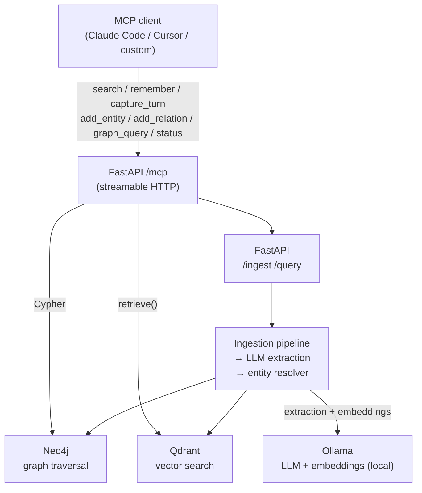

# Landscape

Landscape is a local-first AI agent memory system for multi-hop reasoning across
documents and conversations. It stores memories in both Neo4j and Qdrant, then
combines vector similarity with graph traversal so an agent can answer questions
that require connecting facts spread across multiple sources.

The core difference from vector-only memory is that Landscape keeps extracted
entities and relationships in a real graph. If an answer depends on a path like
`Project Aurora -> Sarah -> Platform Team`, retrieval can traverse that path
directly instead of hoping one chunk is semantically close enough to contain the
whole answer. Extracted relationships also preserve temporal and numeric
qualifiers, so facts like "Eric watched 8 hours of Netflix today" retain the
`8 hours` and `today` metadata rather than collapsing to only
`ERIC -> WATCHED -> NETFLIX`.

Everything runs locally with Docker Compose, FastAPI, Neo4j, Qdrant, Ollama,
LangChain, and Model Context Protocol.

## The killer demo

Seven questions across 1/2/3-hop bands, same killer-demo corpus (`tests/fixtures/killer_demo_corpus/`):

| Mode                 | P@k    | MRR    | Notes                                               |
|----------------------|--------|--------|-----------------------------------------------------|
| Landscape (hybrid)   | 100%   | 0.306  | Hits all 7 queries including the 3-hop chain        |
| Landscape (vector)   | 71.4%  | 0.149  | Misses the 2-hop "who approved Aurora's database?"  |
| ChromaDB*            | 86%    | 0.43*  | Misses the 3-hop chain entirely (P@1 = 0% at 3-hop) |

*ChromaDB is evaluated at chunk level; Landscape at entity level. Do not compare MRR numbers directly — the granularity differs. The apples-to-apples claim is per-question: ChromaDB answers 6/7 questions (all 1/2-hop), Landscape hybrid answers 7/7 including the one that requires "Aurora → Sarah → Platform Team" in a single traversal. No single chunk in the corpus contains that chain, so chunk similarity can never surface it.

The 3-hop question is the proof point. Reproduce the benchmark with:

```bash
uv sync --extra dev --extra bench
uv run python scripts/bench_retrieval.py    # Landscape hybrid + vector + graph
uv run python scripts/bench_chromadb.py     # ChromaDB baseline
```

## Architecture


```mermaid
graph TD
    Client["MCP client\n(Claude Code / Cursor / custom)"]
    MCP["FastAPI /mcp\n(streamable HTTP)"]
    API["FastAPI\n/ingest  /query"]
    Pipeline["Ingestion pipeline\n→ LLM extraction\n→ entity resolver"]
    Neo4j["Neo4j\ngraph traversal"]
    Qdrant["Qdrant\nvector search"]
    Ollama["Ollama\nLLM + embeddings (local)"]

    Client -->|"search / remember / capture_turn\nadd_entity / add_relation / graph_query / status"| MCP
    MCP --> API
    API --> Pipeline
    Pipeline --> Neo4j
    Pipeline --> Qdrant
    Pipeline -->|"extraction + embeddings"| Ollama
    MCP -->|"retrieve()"| Qdrant
    MCP -->|"Cypher"| Neo4j
```

## Current status

| Area | Status |
|---|---|
| Text ingestion | LLM extraction, chunking, entity resolution, Neo4j writes, Qdrant writes |
| Hybrid retrieval | Vector search, graph expansion, merge/rank, recency and distance scoring |
| Temporal memory | Bitemporal facts: separate system time (`ingested_at` / `system_until`) and valid time (`effective_from` / `effective_until`); supersession-aware retrieval for functional conflicts; `as_of` time-travel queries; negative-polarity facts stored and surfaced distinctly |
| Quantified facts | Relationship edges preserve counts, durations, prices, frequencies, and time scopes |
| Agent access | MCP server, conversation history, LangChain retriever, FastAPI, local CLI |
| Benchmarks | Killer-demo retrieval benchmark, ChromaDB baseline, LongMemEval smoke harness |
| Phase 3.5 hardening | In progress: ranking tuning, benchmark hardening, relation normalization, resolver improvements |
| Phase 4 | Next major feature area: expanded ingestion paths for documents, integrations, conversations, and multimodal memory |

See [docs/ARCHITECTURE.md](docs/ARCHITECTURE.md) for design rationale, data
model details, benchmark notes, and known limitations.

## Quickstart

### Prerequisites

- Python 3.12+
- [uv](https://docs.astral.sh/uv/)
- Docker and Docker Compose
- Ollama, either in Docker via a Compose profile or running on the host

```bash
git clone https://github.com/ben-kahl/landscape.git
cd landscape

./scripts/detect-stack.sh
docker compose up -d

uv sync --extra dev
uv run pytest -m "unit or smoke"               # CI-safe sanity check
uv run python scripts/demo_mcp_session.py      # supersession demo transcript
```

`scripts/detect-stack.sh` creates `.env`, sets `COMPOSE_PROFILES`, and chooses
the appropriate Ollama mode for the host: NVIDIA GPU, AMD GPU, CPU, or host
Ollama on macOS.

The checked-in `.env.example` keeps the higher-quality Nomic embedding model as
the default. That model requires Hugging Face remote model code, so the example
env file also sets `ALLOW_REMOTE_MODEL_CODE=true`. If you switch to a model
like `sentence-transformers/all-MiniLM-L6-v2`, you can remove that flag and
keep remote model code disabled.

### Test database isolation

Stack-backed tests use a separate Neo4j/Qdrant Compose stack by default so test
cleanup does not wipe your local development memory:

```bash
docker compose -f docker-compose.test.yml up -d
uv run pytest
```

Default test endpoints:

| Service | Test endpoint | Live dev endpoint |
|---|---|---|
| Neo4j Bolt | `bolt://localhost:17687` | `bolt://localhost:7687` |
| Neo4j Browser | `http://localhost:17474` | `http://localhost:7474` |
| Qdrant HTTP | `http://localhost:16333` | `http://localhost:6333` |
| Qdrant gRPC | `localhost:16334` | `localhost:6334` |

Override the test services with `LANDSCAPE_TEST_NEO4J_URI`,
`LANDSCAPE_TEST_NEO4J_USER`, `LANDSCAPE_TEST_NEO4J_PASSWORD`, and
`LANDSCAPE_TEST_QDRANT_URL`. Tests refuse to wipe the live default Neo4j/Qdrant
ports unless `LANDSCAPE_ALLOW_LIVE_TEST_WIPE=1` is set deliberately.

Ollama still defaults to `http://localhost:11434`; tests do not wipe Ollama
state.

If the script selects Docker-managed Ollama, pull the default model once:

```bash
docker compose exec ollama-cpu ollama pull llama3.1:8b        # CPU profile
docker compose exec ollama-nvidia ollama pull llama3.1:8b     # NVIDIA profile
docker compose exec ollama-amd ollama pull llama3.1:8b        # AMD profile
```

On macOS, run Ollama on the host and let Docker reach it through
`host.docker.internal`:

```bash
brew install ollama
ollama serve
ollama pull llama3.1:8b
docker compose up -d
```

You can still bypass detection and set `COMPOSE_PROFILES` manually in `.env`.
Supported profiles are `cpu`, `gpu-nvidia`, `gpu-amd`, and `host`.

## CLI

Use the CLI to inspect and operate the local Landscape stack:

```bash
uv run landscape --help
uv run landscape status --verbose
uv run landscape ingest /path/to/document.md
uv run landscape ingest /path/to/document.md --title "Architecture Notes" --source-type markdown
uv run landscape ingest-dir ./docs --glob "*.md"
uv run landscape query "Who leads the project using PostgreSQL?"
uv run landscape graph counts
uv run landscape graph entity "Project Atlas"
uv run landscape graph neighbors "Project Atlas" --hops 2
uv run landscape seed killer-demo --confirm
uv run landscape wipe --confirm
```

The CLI defaults to host-reachable service URLs for local use: Neo4j on
`bolt://localhost:7687`, Qdrant on `http://localhost:6333`, and Ollama on
`http://localhost:11434`. Explicit environment variables still override those
defaults.

## Run the API and embedded MCP server

Start the shared FastAPI + MCP app:

```bash
uv run uvicorn landscape.main:app --host 127.0.0.1 --port 8000
```

The MCP endpoint is mounted at `http://127.0.0.1:8000/mcp`.

Retrieval logs under `logs/retrieval/` now hash `query_text` and `session_id`
by default. Raw values are only written when a caller explicitly enables
request-level debug logging with `debug=true`.

### Authentication

`/query`, `/ingest`, and `/mcp` all require a valid bearer token. `/healthz`
stays public.

Landscape uses **OAuth 2.1 Authorization Code + PKCE** (RFC 6749 + RFC 7636).
Clients self-register via dynamic registration — no manual token minting
required. MCP clients like Claude Code and Codex handle the full OAuth flow
automatically when pointed at the server URL.

**Connecting Claude Code or Codex.** Add the MCP server URL to your client
config:

```
http://localhost:8000/mcp
```

On first connection the client opens the browser to complete the OAuth flow,
obtains an access token, and stores it locally. Subsequent connections reuse
the token until it expires, then refresh automatically.

**Scopes.** Two scopes are available:

- `agent` — memory tools: `search`, `remember`, `add_entity`, `add_relation`,
  `status`, `conversation_history`, `capture_turn`
- `graph_query` — raw read-only Cypher via the `/query` endpoint

Clients default to `agent` scope. Request `graph_query` explicitly if needed.

**Inspecting and revoking clients.** CLI commands read the local SQLite auth DB
directly — no network calls:

```bash
# Show all registered OAuth clients and their status
landscape auth list-clients

# Prevent a client from obtaining new tokens (access + refresh both invalidated)
landscape auth disable-client --client-id <client-id>

# Re-enable a previously disabled client
landscape auth enable-client --client-id <client-id>
```

**Where the auth DB lives.** Defaults to `~/.config/landscape/auth.db`.
Override with `AUTH_DB_PATH`. Under docker-compose the path is pinned to
`/var/lib/landscape/auth.db` on a named volume (`landscape_auth_data`)
so registered clients survive container rebuilds.

**Remote / cloud deployment.** Set `MCP_ISSUER_URL` to the public HTTPS URL
of your deployment:

```bash
MCP_ISSUER_URL=https://landscape.example.com
```

The issuer URL is embedded in OAuth discovery metadata (`/.well-known/oauth-authorization-server`),
so clients resolve the correct token and registration endpoints automatically.
HTTPS is required for remote deployments — the OAuth spec prohibits non-loopback
HTTP redirect URIs without TLS.

## Use Landscape as MCP memory

Configure your MCP client to connect to the shared HTTP endpoint instead of
launching a standalone MCP subprocess.

For clients that accept a URL-based MCP server definition, point them at:

```text
http://127.0.0.1:8000/mcp
```

If your MCP client uses a different config shape, the essential inputs are:

- server URL: `http://127.0.0.1:8000/mcp`
- the FastAPI app must already be running
- the existing `NEO4J_*`, `QDRANT_URL`, and `OLLAMA_URL` env vars still apply to the server process

The MCP tools:

| Tool | Description |
|---|---|
| `search` | Hybrid retrieve: vector similarity + graph traversal up to N hops; accepts `as_of` (ISO-8601) for time-travel queries against historical fact state |
| `remember` | Ingest free-text; extract entities and relations into the graph |
| `capture_turn` | Capture an explicit conversation turn and schedule background ingestion |
| `add_entity` | Directly assert a named entity with type and provenance |
| `add_relation` | Assert a typed edge between two entities; supersedes functional conflicts |
| `graph_query` | Run a read-only Cypher query against the knowledge graph |
| `status` | Return a ~200-token summary: entity count, top entities, recent agent writes |
| `conversation_history` | Return chronological turns and entities mentioned in a session |

### Automatic MCP conversation ingestion

Landscape can ingest eligible MCP conversation turns through `capture_turn`.
Clients provide `session_id`, `turn_id`, `role`, and `text`; Landscape validates
the turn, schedules ingestion in the background, and returns immediately. The
foreground agent interaction is not blocked on extraction, embedding, Neo4j
writes, or Qdrant writes.

`capture_turn` is the MCP-first safety-net path for ordinary conversation
memory. `remember` remains the explicit synchronous document-ingest tool, and
`add_entity` / `add_relation` remain the precise structured write-back tools.

### Agent hook conversation capture

Most agent MCP clients do not stream their full conversation transcript to MCP
servers automatically. For set-and-forget capture, use the checked-in hook
adapters to call Landscape's HTTP hook receiver:

```text
POST http://127.0.0.1:8000/hooks/conversation-turn
```

The receiver accepts `{client, session_id, turn_id, role, text}`, applies the
same eligibility checks as `capture_turn`, and schedules background ingestion.
It requires the same bearer auth as the other FastAPI write endpoints, so hook
processes should export:

```bash
export LANDSCAPE_API_TOKEN="<oauth access token with agent scope>"
export LANDSCAPE_HOOK_URL="http://127.0.0.1:8000/hooks/conversation-turn"
```

Hook examples live under `hooks/`:

| Client | Files | Notes |
|---|---|---|
| Claude Code | `hooks/claude-code/settings.example.json` | Copy or merge into `.claude/settings.json` or `~/.claude/settings.json`. Captures user prompts and the latest assistant transcript turn on `Stop`. |
| Codex | `hooks/codex/config.example.toml`, `hooks/codex/hooks.example.json` | Enable `codex_hooks`, then copy or merge hooks into `.codex/` or `~/.codex/`. Captures prompt and stop hook payloads when Codex exposes them. |
| OpenCode | `hooks/opencode/landscape-conversation.js` | Copy into `.opencode/plugins/` or `~/.config/opencode/plugins/`. Captures `message.updated` events. |

All examples call `scripts/landscape_capture_hook.py`, which normalizes each
client's hook payload before posting to Landscape. Keep using MCP `remember`
for deliberate document ingestion; hooks are intended for low-friction
conversation memory.

### MCP transport note

The recommended setup is the shared streamable HTTP endpoint mounted at
`http://127.0.0.1:8000/mcp`. When clients connect to that endpoint, they share
the same long-running FastAPI/MCP server process.

Standalone stdio MCP launchers remain process-per-client: each client or
subagent that starts `landscape-mcp` gets its own server subprocess. Use the
HTTP endpoint when you want multiple agents to share one Landscape MCP instance.

## Reproduce the benchmarks

```bash
uv sync --extra dev --extra bench
uv run python scripts/bench_retrieval.py    # Landscape hybrid + vector + graph
uv run python scripts/bench_chromadb.py     # ChromaDB baseline
```

Results are printed as a Markdown table. On the killer-demo corpus, hybrid retrieval stays at 7/7 P@k (100.0%) with 0.326 MRR and 64ms average latency; vector-only reaches 85.7% P@k, 0.213 MRR, and 42ms latency; graph-only remains at 0.0% P@k, 0.000 MRR, and 2ms latency. The killer-demo corpus lives in `tests/fixtures/killer_demo_corpus/`.

## Bitemporal facts

Every `MemoryFact` (and the live `MEMORY_REL` edge that mirrors it) carries two
independent time axes:

| Axis | Fields | Meaning |
|---|---|---|
| System time | `ingested_at`, `system_until` | When Landscape learned the fact and, if superseded, when a newer version took over. `system_until` is `NULL` for the current version. |
| Valid time | `effective_from`, `effective_until` | When the fact was true in the world. Extracted from the source text when an explicit calendar reference is present; otherwise `NULL`. |

Retrieval defaults to "current as of now": facts where `system_until IS NULL`.
The `as_of` parameter on `search` (API, CLI, and MCP) shifts the system-time
filter so callers can ask what Landscape *believed* at a past moment, even if
that belief has since been superseded. Pass `include_historical=true` to bypass
the system-time filter entirely.

When a functional fact is superseded, the prior version's `system_until` is
closed to the new fact's `effective_from` (not just "now"), so the system-time
chain reflects the actual succession point in the world rather than ingest
order.

## Design rationale and known limitations

See [docs/ARCHITECTURE.md](docs/ARCHITECTURE.md) for the full design rationale.
Three limitations worth calling out here before phase 4:

**Rel-type synonym drift.** Small local LLMs are non-deterministic about relationship type phrasing (`WORKS_FOR` vs `EMPLOYED_BY`). Landscape uses a closed vocabulary of 22 canonical types (with subtype annotations for richer semantics) and a `normalize_relation_type()` normalizer, but truly novel types pass through unchanged and will not trigger supersession. Demos that rely on temporal conflict resolution should use hand-constructed corpora.

**MCP tool-call reliability.** LLM agents invoking `add_relation` may invent relationship types outside the canonical vocabulary. These are stored as-is and do not trigger supersession rules. Monitor the `status` tool output for unexpected rel types in a live session.

**Entity resolver type-match strictness.** The resolver requires entity type agreement before merging; an agent that writes `("Sarah", "PERSON")` when the ingestion pipeline stored `("Sarah", "Employee")` will create a duplicate node rather than resolving to the existing one.

## License

Landscape is licensed under the Apache License 2.0. See
[LICENSE.txt](LICENSE.txt).
